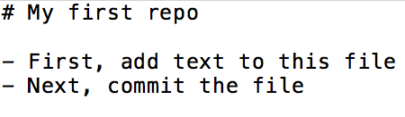
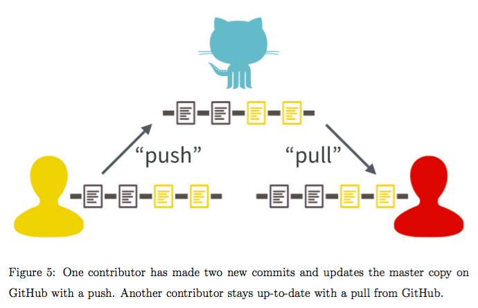

```{r setup, include=FALSE}
knitr::opts_chunk$set(echo = TRUE, eval = FALSE)
```

## Resources
- [Happy Git with R (still very useful for non-R users!)](http://happygitwithr.com/)
- [Excuse me, do you have a moment to talk about version control?](https://peerj.com/preprints/3159.pdf)
- [git vs. Dropbox from a researcher's perspective](https://michaelstepner.com/blog/git-vs-dropbox)

# What is version control?

## What is Git? What is Github?
- Git is a version control system (local, on your computer)
- Github is a hosting service for Git repositories (remote, on the internet)
- "GitHub is like DropBox or Google Drive, but more structured, powerful, and programmatic"

## Why does this matter for research?
- Git was built for collaborative software development; it has been re-purposed for data science and various kinds of empirical research including in economics
- Git is very powerful, maybe "too powerful" for our purposes
- Our aim is not total mastery of Git, but how we can use it to complement our needs

# Setting up Git and Github

## Set up a Github account
- [https://github.com/](https://github.com/)
- [Some tips here](http://happygitwithr.com/github-acct.html)
    + Try to get your username right the first time!
- Academia gets free private repos: request from [https://education.github.com/](https://education.github.com/)

## Install Git
- [Follow this section of Happy Git with R closely](http://happygitwithr.com/install-git.html)

## Introduce yourself to Git

Run the code below in your [shell](http://happygitwithr.com/shell.html). 

- `user.name`: use some version of your real name so we know who is making changes
- `user.email`: you **MUST** use the email associated with your Github account

```{bash, eval = FALSE}
git config --global user.name 'weiyangtham'
git config --global user.email 'weiyang.tham@gmail.com'
```

```{bash, eval = F}
git config --global --list
```

## Git client
- [GitKraken](https://www.gitkraken.com/) is a good option for us as it works across all Windows, Mac, and Linux
- Minimize having to deal with command line
- Makes version control a lot more intuitive by visualizing it
- You can have a GUI and also do stuff from the command line if you have to
- If you use R, RStudio has a simple Git GUI 
- DO NOT use the free Github client
- More Git clients [here](http://happygitwithr.com/git-client.html)

# Your first Github commit

## Create a repository on Github
- Go to your Github account: https://github.com/yourname
- Click on "Repositories"
- Click on the green "New" button
- Check "Initialize this repository with a README"


- Click "Create Repository"
- Congratulations! You have made your first Github repository! `r emo::ji("popper")` ``r emo::ji("confetti")`

## Clone your Github repo
- Click "Clone or download" and copy the URL that appears
- Open Gitkraken
- Click the folder `r emo::ji("folder")` icon and select "Clone"
- Select the directory where you want to store your project
    + For example, I have a "Projects" directory where I keep all my projects
    + Note, you DO NOT have to manually create a folder for the `workshop_example` repo
    


- Go to the directory where you chose to clone your project and check that you now have a new folder called `workshop_example`

## Your first commit
- In the directory where your project resides, open the `README.md` file with a plain text editor (like Notepad for Windows or TextEdit for Mac)
- Delete the current text, then type in the text from the image below and then save the file


- In GitKraken, go to "Unstaged Files" and click on `README.md`. What do you see?
- Click on the "Stage File" button to the right of `README.md`, then click in the Commit Message box below where it says "Summary". Type "First commit from GitKraken". 
- Now you're ready to commit your first file! 
     + Click on the giant green button in the bottom right corner
     + Notice how your commit has been added to the middle of the GitKraken app along with the commit message that you wrote
     
# Github as a project website

- Go to the Github page for the repository you just created; notice how the README file has been rendered nicely
- You can use [Github Pages](https://pages.github.com/) to create a project website. [Example](https://weiyangtham.github.io/methods_workshop/)
- If you need to share data, Github renders `.tsv` and `.csv` files nicely (smaller than 512Kb)
- Browsing code and files: convenient and pleasant way to browse through your files or even a [manuscript](https://github.com/weiyangtham/stem_cells/blob/b1d6a3c3c4d4fce4b262048884d40604f0f09576/manuscripts/paper.Rmd)
- Github issues: use as a to-do list. Comes with Markdown formatting
    - Go to your repo and try filing an issue

# Workflow


<!--
Consider 2 ways of collaborating on a document:

- **Edit, save, attach.** Everyone has (at least) one copy of the document, which circulates in multiple forms as an e-mail attachment. Hard to reconcile edits from different people.

- **Google Doc.** There is only one copy of the document and it lives in the cloud. Everyone can see changes and previous versions can be reverted to if disaster strikes.  

Git/Github is like the **Google Doc** style but with some features from **Edit, save, attach**, namely, the ability to work offline and seperately. 
-->

Git/Github is like working with a **Google Doc** style - only one copy of the document exists and lives in the cloud - but with the ability to work offline and seperately, and then integrate changes made locally on different computers. 

1. In this system, Github is the clearinghouse and holds the master copy of the project. Each collaborator has their own complete copy of the repo and its history.
1. You **pull** regularly to receive and integrate changes from your collaborators. Likewise, you **push** regularly to Github so that it maintains its status as the master copy
1. A simple and helpful rule: If you have a project that exists on multiple computers (even if you are the only collaborator!), **pull** every time you open it up to work on it
1. Commit small changes and push to Github frequently

What happens if two people try to push changes to Github?

- Suppose your collaborator has made a change and pushed it to Github, but you haven't pulled the latest version to your computer. Now if you make and commit a change locally and try to push that to Github, you will fail and Github will prompt you to pull first. 
- Usually Github can integrate your changes with your collaborator's changes smoothly - if not, you will have to resolve the **merge conflict**
- Better to avoid merge conflicts by committing small changes and syncing regularly with Github

## Which files to commit?

Types of files:

- Source files: Code (Stata .do files, R scripts), Markdown, LaTex files
- Configuration files: These files modify the behavior of a tool, for example .gitignore identifies files Git should not track and some-project.Rproj records RStudio project settings.
- Derived products (e.g. reports, images, intermediate data products): pdf, .docx, .png, .csv, .tsv
- Intermediates: e.g. `.aux` or `.log` LaTex files - Generally don't commit these files and might add them to `.gitignore`

Most importantly, is it useful to someone? If it is, track it!

# Next steps

- Start out with a solo project and get used to the practice of committing your work regularly and pushing it to Github
- Once you get comfortable with the idea of pushing and pulling, you can try more advanced commands like `git branch`
- Don't be afraid to keep things simple - for what we do, knowing how to **push**, **pull**, and work with Github will get you 90\% of the value