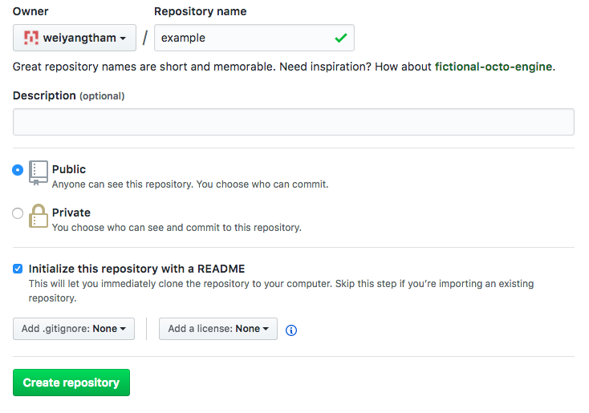
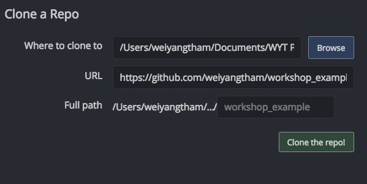

```{r setup, include=FALSE}
knitr::opts_chunk$set(echo = TRUE, eval = FALSE)
```

## Resources
- [Happy Git with R (still very useful for non-R users!)](http://happygitwithr.com/)
- [Excuse me, do you have a moment to talk about version control?](https://peerj.com/preprints/3159.pdf)
- [git vs. Dropbox from a researcher's perspective](https://michaelstepner.com/blog/git-vs-dropbox)

# What is version control?

## What is Git? What is Github?
- Git is a version control system
- Github is a hosting service for Git repositories
- " GitHub is like DropBox or Google Drive, but more structured, powerful, and programmatic"

## Why does this matter for research?
- Git was built for collaborative software development; it has been re-purposed for data science and various kinds of empirical research including in economics
- Git is very powerful, maybe "too powerful" for our purposes
- Our aim is not total mastery of Git

# Setting up Git and Github

## Set up a Github account
- [https://github.com/](https://github.com/)
- [Some tips here](http://happygitwithr.com/github-acct.html)
    + Try to get your username right the first time!
- Academia gets free private repos: request from [https://education.github.com/](https://education.github.com/)

## Install Git
- [Follow this section of Happy Git with R closely](http://happygitwithr.com/install-git.html)

## Introduce yourself to Git

Run the code below in your [shell](http://happygitwithr.com/shell.html). 

- `user.name`: use some version of your real name so we know who is making changes
- `user.email`: you **MUST** use the email associated with your Github account

```{bash, eval = FALSE}
git config --global user.name 'weiyangtham'
git config --global user.email 'weiyang.tham@gmail.com'
```

```{bash, eval = F}
git config --global --list
```

## Git client
- [GitKraken](https://www.gitkraken.com/) is a good option for us as it works across all Windows, Mac, and Linux
- Minimize having to deal with command line
- Makes version control a lot more intuitive by visualizing it
- You can have a GUI and also do stuff from the command line if you have to
- If you use R, RStudio has a simple Git GUI 
- DO NOT use the free Github client
- More Git clients [here](http://happygitwithr.com/git-client.html)

# Your first Github commit

## Create a repository on Github
- Go to your Github account: https://github.com/yourname
- Click on "Repositories"
- Click on the green "New" button
- Check "Initialize this repository with a README"



- Click "Create Repository"
- Congratulations! You have made your first Github repository! `r emo::ji("popper")` ``r emo::ji("confetti")`

## Clone your Github repo
- Click "Clone or download" and copy the URL that appears
- Open Gitkraken
- Click the folder `r emo::ji("folder")` icon and select "Clone"
- Select the directory where you want to store your project
    + For example, I have a "Projects" directory where I keep all my projects
    + Note, you DO NOT have to manually create a folder for the `workshop_example` repo
    


## .gitignore


